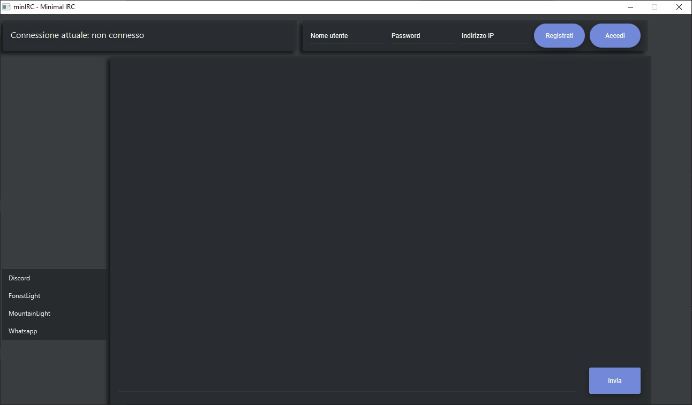
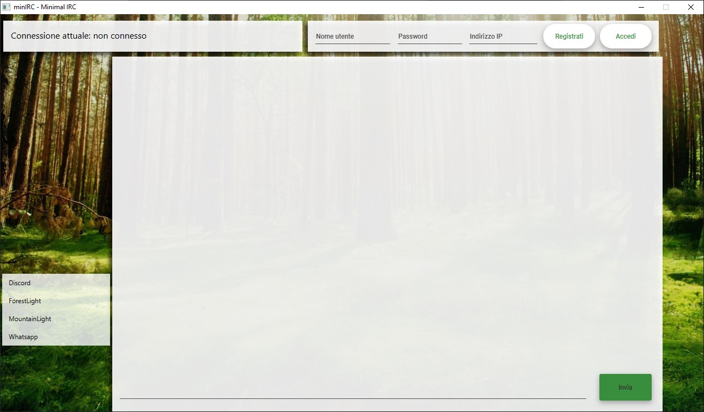
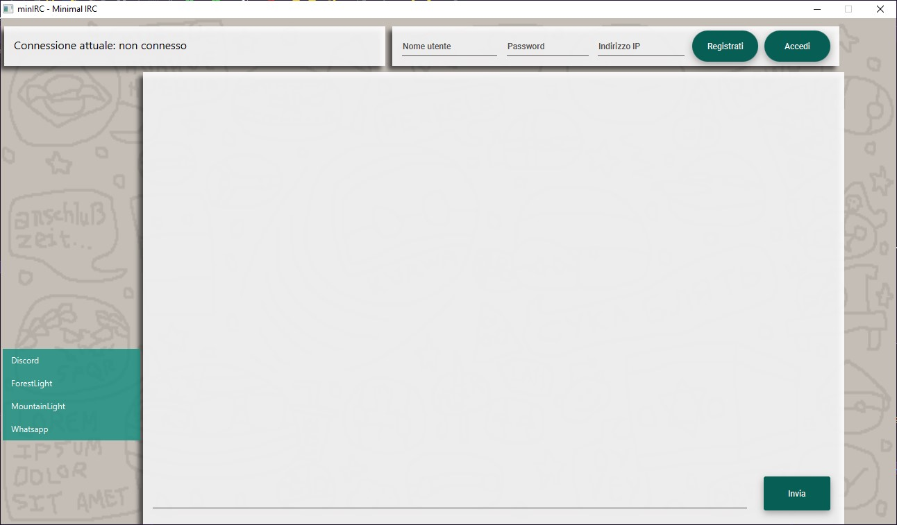
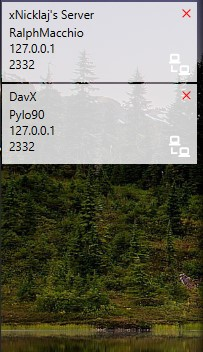
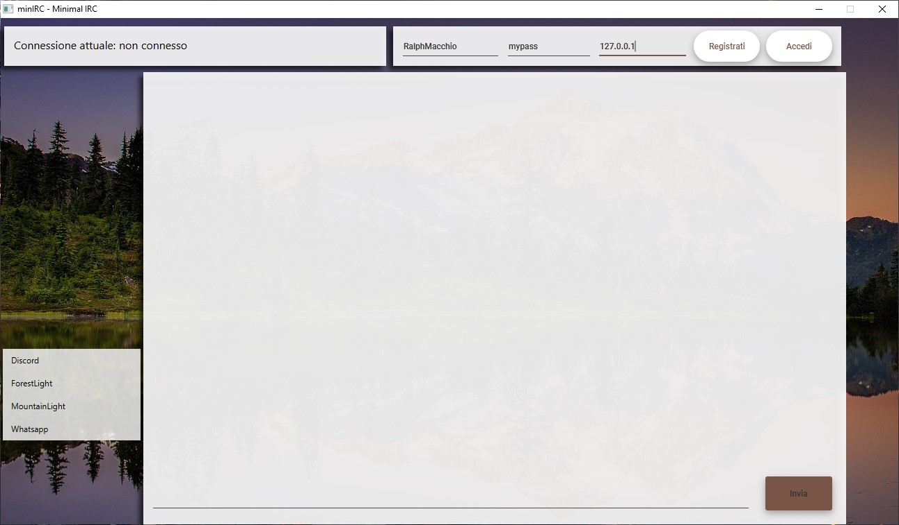
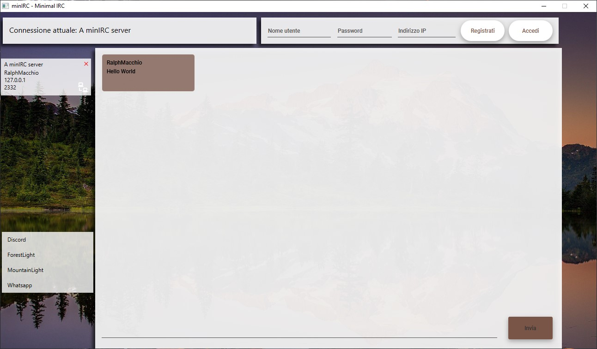

# Welcome to minIRC, a JavaFX based Internet Relay Chat written by Simone Aronica.
It's built of two components, the client and the server. Here you can find the client component,
while the server is at https://www.github.com/xNicklaj/minIRC---server
Feel free to look at the code, fork, try it out or edit it yourself.

Benvenuto a minIRC, un'Internet Relay Chat scritta da Simone Aronica.
Essa è fatta da due componenti, il client ed il server. Qua puoi trovare il componente client, 
mentre il server è al link https://www.github.com/xNicklaj/minIRC---server
Sentiti libero di guardare il codice, creare un tuo fork, provarlo oppure modificarlo.

## Screenshots
### Themes / Temi

#And even more! All the themes are stored in a theme directory, and built on css,
so that you can create your own set of themes.

E persino di più! Tutti i temi sono contenuti in una cartella dei temi, e realizzati con css,
così che anche tu possa creare i tuoi temi.
### Lista di Server / Custom serverlist

### Esempi / Examples

